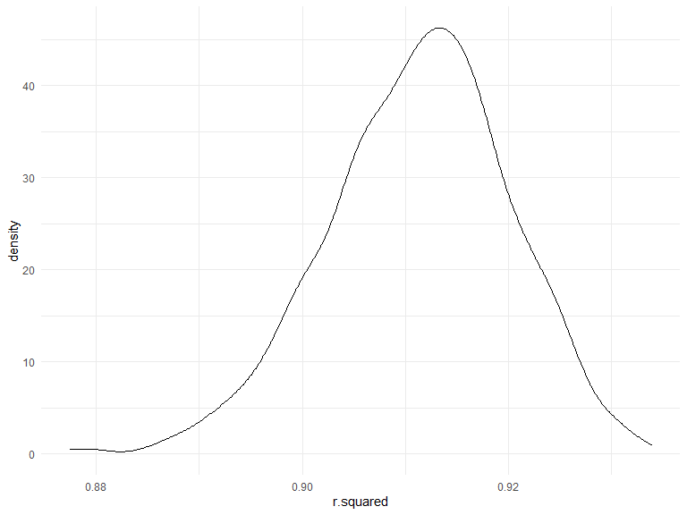

Homework 6
================
Ayako Sekiya

## Problem 1

To obtain a distribution for $\hat{r}^2$, we’ll follow basically the
same procedure we used for regression coefficients: draw bootstrap
samples; the a model to each; extract the value I’m concerned with; and
summarize. Here, we’ll use `modelr::bootstrap` to draw the samples and
`broom::glance` to produce `r.squared` values.

``` r
weather_df = 
  rnoaa::meteo_pull_monitors(
    c("USW00094728"),
    var = c("PRCP", "TMIN", "TMAX"), 
    date_min = "2017-01-01",
    date_max = "2017-12-31") %>%
  mutate(
    name = recode(id, USW00094728 = "CentralPark_NY"),
    tmin = tmin / 10,
    tmax = tmax / 10) %>%
  select(name, id, everything())
```

    ## Registered S3 method overwritten by 'hoardr':
    ##   method           from
    ##   print.cache_info httr

    ## using cached file: C:\Users\KAMONO~1\AppData\Local/Cache/R/noaa_ghcnd/USW00094728.dly

    ## date created (size, mb): 2022-09-06 10:44:32 (8.414)

    ## file min/max dates: 1869-01-01 / 2022-09-30

``` r
weather_df %>% 
  modelr::bootstrap(n = 1000) %>% 
  mutate(
    models = map(strap, ~lm(tmax ~ tmin, data = .x) ),
    results = map(models, broom::glance)) %>% 
  select(-strap, -models) %>% 
  unnest(results) %>% 
  ggplot(aes(x = r.squared)) + geom_density()
```



In this example, the $\hat{r}^2$ value is high, and the upper bound at 1
may be a cause for the generally skewed shape of the distribution. If we
wanted to construct a confidence interval for $R^2$, we could take the
2.5% and 97.5% quantiles of the estimates across bootstrap samples.
However, because the shape isn’t symmetric, using the mean +/- 1.96
times the standard error probably wouldn’t work well.

We can produce a distribution for $\log(\beta_0 * \beta1)$ using a
similar approach, with a bit more wrangling before we make our plot.

``` r
weather_df %>% 
  modelr::bootstrap(n = 1000) %>% 
  mutate(
    models = map(strap, ~lm(tmax ~ tmin, data = .x) ),
    results = map(models, broom::tidy)) %>% 
  select(-strap, -models) %>% 
  unnest(results) %>% 
  select(id = `.id`, term, estimate) %>% 
  pivot_wider(
    names_from = term, 
    values_from = estimate) %>% 
  rename(beta0 = `(Intercept)`, beta1 = tmin) %>% 
  mutate(log_b0b1 = log(beta0 * beta1)) %>% 
  ggplot(aes(x = log_b0b1)) + geom_density()
```


As with $r^2$, this distribution is somewhat skewed and has some
outliers.

The point of this is not to say you should always use the bootstrap –
it’s possible to establish “large sample” distributions for strange
parameters / values / summaries in a lot of cases, and those are great
to have. But it is helpful to know that there’s a way to do inference
even in tough cases.

## Problem 2

``` r
homicide = 
  read_csv(file = "./data/homicide-data.csv") %>% 
  janitor::clean_names() 
```

    ## Rows: 52179 Columns: 12
    ## ── Column specification ────────────────────────────────────────────────────────
    ## Delimiter: ","
    ## chr (9): uid, victim_last, victim_first, victim_race, victim_age, victim_sex...
    ## dbl (3): reported_date, lat, lon
    ## 
    ## ℹ Use `spec()` to retrieve the full column specification for this data.
    ## ℹ Specify the column types or set `show_col_types = FALSE` to quiet this message.

#### Data Cleaning

Create a city_state variable (e.g. “Baltimore, MD”), and a binary
variable indicating whether the homicide is solved. The number of
unsolved homicides is those for which the disposition is “Closed without
arrest” or “Open/No arrest”.Omit cities Dallas, TX; Phoenix, AZ; and
Kansas City, MO – these don’t report victim race. Also omit Tulsa, AL –
this is a data entry mistake. For this problem, limit your analysis
those for whom victim_race is white or black. Be sure that victim_age is
numeric.

``` r
homicide_data=
  homicide %>% 
  unite("city_state", city:state, remove = FALSE, sep=", ") %>% 
  group_by(city_state) %>% 
  filter(city_state!="Dallas, TX" & city_state!="Phoenix, AZ" & city_state!="Kansas City, MO"& city_state!="Tulsa, AL") %>%
  filter(victim_race=="White" | victim_race=="Black") %>% 
  mutate(
    resolved = as.numeric(disposition == "Closed by arrest"),
    victim_age = as.numeric(victim_age),
    victim_race = fct_relevel(victim_race, "White")) %>% 
  drop_na(victim_age) %>% 
  select(resolved, victim_age, victim_race, victim_sex)
```

    ## Adding missing grouping variables: `city_state`

There are 5 columns and 39403 observations in this data set. The
variables are city_state, resolved, victim_age, victim_race, victim_sex.

For the city of Baltimore, MD, use the glm function to fit a logistic
regression with resolved vs unresolved as the outcome and victim age,
sex and race as predictors. Save the output of glm as an R object; apply
the broom::tidy to this object

``` r
fit_logistic= homicide_data %>% 
  filter(city_state=="Baltimore, MD") %>% 
  glm(resolved ~ victim_age + victim_race + victim_sex, data = ., family = binomial()) %>% 
  broom::tidy() 
```

Obtain the estimate and confidence interval of the adjusted odds ratio
for solving homicides comparing male victims to female victims keeping
all other variables fixed.

``` r
baltimore_df= fit_logistic %>% 
  mutate(log_OR = estimate,
         OR = exp(estimate),
        ci_low=exp(estimate-1.96*std.error),
        ci_high=exp(estimate+1.96*std.error)) %>%
  select(term,log_OR, OR,ci_low,ci_high) %>% 
  filter(term == "victim_sexMale")

baltimore_df %>% 
  knitr::kable(digits = 3)
```

| term           | log_OR |    OR | ci_low | ci_high |
|:---------------|-------:|------:|-------:|--------:|
| victim_sexMale | -0.854 | 0.426 |  0.325 |   0.558 |

The adjusted odds ratio for solving homicides comparing male victims to
female victims keeping all other variables fixed is 0.426 (95%CI: 0.325,
0.558). In the city of Baltimore the odds of solving homicides among
male victims is 0.426 times the odds of solving homicides among female
victims.

#### Mapping

Now run glm for each of the cities in your dataset, and extract the
adjusted odds ratio (and CI) for solving homicides comparing male
victims to female victims. Do this within a “tidy” pipeline, making use
of purrr::map, list columns, and unnest as necessary to create a
dataframe with estimated ORs and CIs for each city.

``` r
homicide_all=
  homicide_data %>% 
  nest(data=-city_state) %>% 
  mutate(
    models = map(.x=data, ~glm(formula=resolved~victim_age + victim_race + victim_sex, data = .x, family = binomial())),
    results = map(models, broom::tidy)) %>% 
  select(-data, -models) %>% 
  unnest(results) %>% 
  mutate(log_OR = estimate,
         OR = exp(estimate),
        ci_low=exp(estimate-1.96*std.error),
        ci_high=exp(estimate+1.96*std.error)) %>%
  select(city_state,term,log_OR, OR,ci_low,ci_high) %>% 
  filter(term == "victim_sexMale")

homicide_all %>% 
  knitr::kable(digits = 3)
```

| city_state         | term           | log_OR |    OR | ci_low | ci_high |
|:-------------------|:---------------|-------:|------:|-------:|--------:|
| Albuquerque, NM    | victim_sexMale |  0.570 | 1.767 |  0.831 |   3.761 |
| Atlanta, GA        | victim_sexMale |  0.000 | 1.000 |  0.684 |   1.463 |
| Baltimore, MD      | victim_sexMale | -0.854 | 0.426 |  0.325 |   0.558 |
| Baton Rouge, LA    | victim_sexMale | -0.964 | 0.381 |  0.209 |   0.695 |
| Birmingham, AL     | victim_sexMale | -0.139 | 0.870 |  0.574 |   1.318 |
| Boston, MA         | victim_sexMale | -0.395 | 0.674 |  0.356 |   1.276 |
| Buffalo, NY        | victim_sexMale | -0.653 | 0.521 |  0.290 |   0.935 |
| Charlotte, NC      | victim_sexMale | -0.123 | 0.884 |  0.557 |   1.403 |
| Chicago, IL        | victim_sexMale | -0.891 | 0.410 |  0.336 |   0.501 |
| Cincinnati, OH     | victim_sexMale | -0.917 | 0.400 |  0.236 |   0.677 |
| Columbus, OH       | victim_sexMale | -0.630 | 0.532 |  0.378 |   0.750 |
| Denver, CO         | victim_sexMale | -0.736 | 0.479 |  0.236 |   0.971 |
| Detroit, MI        | victim_sexMale | -0.541 | 0.582 |  0.462 |   0.734 |
| Durham, NC         | victim_sexMale | -0.208 | 0.812 |  0.392 |   1.683 |
| Fort Worth, TX     | victim_sexMale | -0.402 | 0.669 |  0.397 |   1.127 |
| Fresno, CA         | victim_sexMale |  0.289 | 1.335 |  0.580 |   3.071 |
| Houston, TX        | victim_sexMale | -0.341 | 0.711 |  0.558 |   0.907 |
| Indianapolis, IN   | victim_sexMale | -0.085 | 0.919 |  0.679 |   1.242 |
| Jacksonville, FL   | victim_sexMale | -0.329 | 0.720 |  0.537 |   0.966 |
| Las Vegas, NV      | victim_sexMale | -0.178 | 0.837 |  0.608 |   1.154 |
| Long Beach, CA     | victim_sexMale | -0.891 | 0.410 |  0.156 |   1.082 |
| Los Angeles, CA    | victim_sexMale | -0.413 | 0.662 |  0.458 |   0.956 |
| Louisville, KY     | victim_sexMale | -0.712 | 0.491 |  0.305 |   0.790 |
| Memphis, TN        | victim_sexMale | -0.324 | 0.723 |  0.529 |   0.988 |
| Miami, FL          | victim_sexMale | -0.663 | 0.515 |  0.304 |   0.872 |
| Milwaukee, wI      | victim_sexMale | -0.319 | 0.727 |  0.499 |   1.060 |
| Minneapolis, MN    | victim_sexMale | -0.054 | 0.947 |  0.478 |   1.875 |
| Nashville, TN      | victim_sexMale |  0.034 | 1.034 |  0.685 |   1.562 |
| New Orleans, LA    | victim_sexMale | -0.536 | 0.585 |  0.422 |   0.811 |
| New York, NY       | victim_sexMale | -1.338 | 0.262 |  0.138 |   0.499 |
| Oakland, CA        | victim_sexMale | -0.574 | 0.563 |  0.365 |   0.868 |
| Oklahoma City, OK  | victim_sexMale | -0.026 | 0.974 |  0.624 |   1.520 |
| Omaha, NE          | victim_sexMale | -0.961 | 0.382 |  0.203 |   0.721 |
| Philadelphia, PA   | victim_sexMale | -0.701 | 0.496 |  0.378 |   0.652 |
| Pittsburgh, PA     | victim_sexMale | -0.842 | 0.431 |  0.265 |   0.700 |
| Richmond, VA       | victim_sexMale |  0.006 | 1.006 |  0.498 |   2.033 |
| San Antonio, TX    | victim_sexMale | -0.350 | 0.705 |  0.398 |   1.249 |
| Sacramento, CA     | victim_sexMale | -0.402 | 0.669 |  0.335 |   1.337 |
| Savannah, GA       | victim_sexMale | -0.143 | 0.867 |  0.422 |   1.780 |
| San Bernardino, CA | victim_sexMale | -0.692 | 0.500 |  0.171 |   1.462 |
| San Diego, CA      | victim_sexMale | -0.884 | 0.413 |  0.200 |   0.855 |
| San Francisco, CA  | victim_sexMale | -0.498 | 0.608 |  0.317 |   1.165 |
| St. Louis, MO      | victim_sexMale | -0.352 | 0.703 |  0.530 |   0.932 |
| Stockton, CA       | victim_sexMale |  0.301 | 1.352 |  0.621 |   2.942 |
| Tampa, FL          | victim_sexMale | -0.214 | 0.808 |  0.348 |   1.876 |
| Tulsa, OK          | victim_sexMale | -0.025 | 0.976 |  0.614 |   1.552 |
| Washington, DC     | victim_sexMale | -0.371 | 0.690 |  0.468 |   1.017 |

#### Plotting

Create a plot that shows the estimated ORs and CIs for each city.
Organize cities according to estimated OR, and comment on the plot.

``` r
homicide_plot= homicide_all %>% 
  filter(str_detect(term, "victim_sex")) %>% 
  ggplot(aes(x = reorder(city_state, OR), y = OR)) + 
  geom_errorbar(aes(ymin = ci_low, ymax = ci_high)) +
  geom_point(alpha = 0.5 ) +  
  labs(
    title = "Adjusted OR for Solving Homicides comparing Males to Females",
    x = "city, state",
    y = "Adjusted OR") +
  theme(plot.title = element_text(size = 12, face = "bold"),
        legend.position = "none", 
        axis.text.x = element_text(angle = 45, vjust = 0.5, hjust = 0.7))
  
homicide_plot
```


``` r
ggsave("results/homicide_plot.pdf", homicide_plot, width = 20, height = 10)
```

Based on this plot, New York, NY has the smallest point estimate for OR.
This means that New York has the smallest odds for solving homicides for
males compared to females. Albuquerque, NM has the highest point
estimate for OR which means that this city has the highest odds for
solving homicides for males compared to females. However, Albuquerque
has a very wide confidence interval, especially when comparing to other
cities.

## Problem 3

Load and clean the data for regression analysis (i.e. convert numeric to
factor where appropriate, check for missing data, etc.).

``` r
birthweight = 
  read_csv(file = "./data/birthweight.csv") %>% 
  janitor::clean_names() %>% 
  mutate( babysex = as.factor(babysex),
          frace = as.factor(frace),
          malform = as.factor(malform),
          mrace = as.factor(mrace))
```

    ## Rows: 4342 Columns: 20
    ## ── Column specification ────────────────────────────────────────────────────────
    ## Delimiter: ","
    ## dbl (20): babysex, bhead, blength, bwt, delwt, fincome, frace, gaweeks, malf...
    ## 
    ## ℹ Use `spec()` to retrieve the full column specification for this data.
    ## ℹ Specify the column types or set `show_col_types = FALSE` to quiet this message.

``` r
sapply(birthweight, function(x) sum(is.na(x)))
```

    ##  babysex    bhead  blength      bwt    delwt  fincome    frace  gaweeks 
    ##        0        0        0        0        0        0        0        0 
    ##  malform menarche  mheight   momage    mrace   parity  pnumlbw  pnumsga 
    ##        0        0        0        0        0        0        0        0 
    ##    ppbmi     ppwt   smoken   wtgain 
    ##        0        0        0        0

There is no missing data. There are 20 columns and 4342 observations in
this data set. The variables are babysex, bhead, blength, bwt, delwt,
fincome, frace, gaweeks, malform, menarche, mheight, momage, mrace,
parity, pnumlbw, pnumsga, ppbmi, ppwt, smoken, wtgain.

#### Model Building

Propose a regression model for birthweight. This model may be based on a
hypothesized structure for the factors that underly birthweight, on a
data-driven model-building process, or a combination of the two.

Bqsed on the homework question and the codebook, I will look at the
following predictors for my model: \* `gaweeks`: gestational age
(weeks)  
\* `mrace`: maternal race  
\* `ppwt`: mother’s pre-pregnancy weight \* `fincome`: family monthly
income (in hundreds, rounded)

The outcome variable will be: \* `bwt`: baby’s birth weight (grams)

``` r
model = lm(bwt ~ gaweeks+mrace+ppwt+fincome, data = birthweight) 
```

Describe your modeling process and show a plot of model residuals
against fitted values – use add_predictions and add_residuals in making
this plot.

``` r
birthweight %>% 
  modelr::add_residuals(model) %>%
  modelr::add_predictions(model) %>%
  ggplot(aes(x = pred, y = resid)) +
  geom_point() +
  labs(
    x = "Fitted values",
    y = "Residuals",
    title = "Model residuals vs fitted values"
  )
```


#### Cross Validation

Compare your model to two others:

One using length at birth and gestational age as predictors (main
effects only)

``` r
maineffect=lm(bwt ~ blength + gaweeks, data =birthweight) %>% 
broom::tidy()
```

One using head circumference, length, sex, and all interactions
(including the three-way interaction) between

``` r
interactions=
lm(bwt ~ bhead + blength + babysex + bhead*blength + bhead*babysex + blength*babysex + bhead*blength*babysex, data = birthweight) %>% 
 broom::tidy()
```

Make this comparison in terms of the cross-validated prediction error;
use crossv_mc and functions in purrr as appropriate.

``` r
bw_df = crossv_mc(birthweight, 100)

bw_df= bw_df%>% 
    mutate(
    train = map(train, as_tibble),
    test = map(test, as_tibble)
  )

bw_df= bw_df %>% 
  mutate(
    model  = map(train, ~lm(bwt ~ gaweeks+mrace+ppwt+fincome, data = .x)),
    maineffect  = map(train, ~lm(bwt ~ blength + gaweeks, data = .x)),
    interactions  = map(train, ~lm(bwt ~ bhead + blength + babysex + bhead*blength + bhead*babysex + blength*babysex + bhead*blength*babysex, data = .x))) %>% 
  mutate(
    rmse_model = map2_dbl(model, test, ~rmse(model = .x, data = .y)),
    rmse_maineffect = map2_dbl(maineffect, test, ~rmse(model = .x, data = .y)),
    rmse_interactions = map2_dbl(interactions, test, ~rmse(model = .x, data = .y)))

# Checking for errors
bw_df %>% 
  select(starts_with("rmse")) %>% 
  pivot_longer(
    everything(),
    names_to = "model", 
    values_to = "rmse",
    names_prefix = "rmse_") %>% 
  mutate(model = fct_inorder(model)) %>% 
  ggplot(aes(x = model, y = rmse)) + geom_violin()
```


Based on the plots created with the code above, the model with all of
the predictors had the highest RMSE, which means that it did not “fit”
the data set as well as the other models. The model with only the main
effect had the second lowest RMSE values, and the model with the
interactions “fit” the data set the best. However, the RMSE values are
still very high across the three models, so these models are not the
most accurate in prediction.
